# 共享页面语义库 v0.1

## 怎么用

页面语义是产物3的装配语言，不是项目事实，也不替代统一业务语义核。它回答五个问题：

1. 这一页为什么存在；
2. 真人第一眼应该看出它在干什么；
3. 它承接哪一类上游业务判断；
4. 它应当用什么视觉结构完成职责；
5. 它把演讲和阅读带到下一页哪里。

真人选择时看中文名称和缩略图；系统装配时使用稳定 `semantic_id`。下表的 ID 不要求真人记忆。

## 快速选择器

| 看图 | 人话名称 | `semantic_id` | 这一页只负责什么 | 常见位置 |
| --- | --- | --- | --- | --- |
|  | 封面主张 | `P3-COVER-CLAIM` | 用一句话锁定项目要解决的购买问题 | 首印象 |
|  | 章节切换 | `P3-SECTION-PROMISE` | 告诉读者下一章要回答什么 | 章节之间 |
| 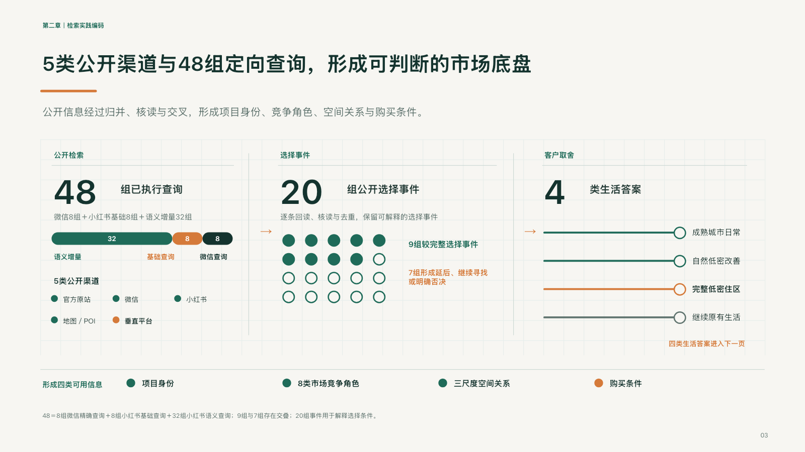 | 检索能力与研究底盘 | `P3-RESEARCH-CREDIBILITY` | 说明工程如何从公开渠道与定向检索形成可判断底盘 | 项目化内容前段，按需 |
| 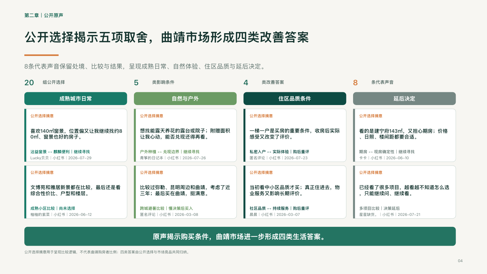 | 公开客户声音 | `P3-BUYER-VOICE` | 用8—10条可追溯公开声音揭示选择条件 | 检索能力页之后，按需 |
| 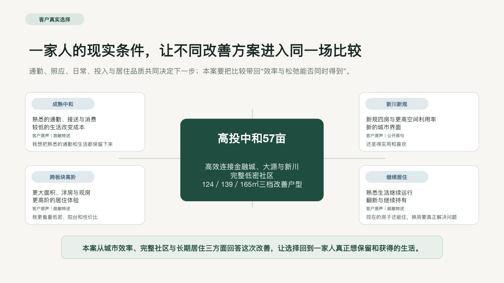 | 客户选择局面 | `P3-CHOICE-SITUATION` | 把不同现实条件放入同一比较 | 第二章起点 |
| 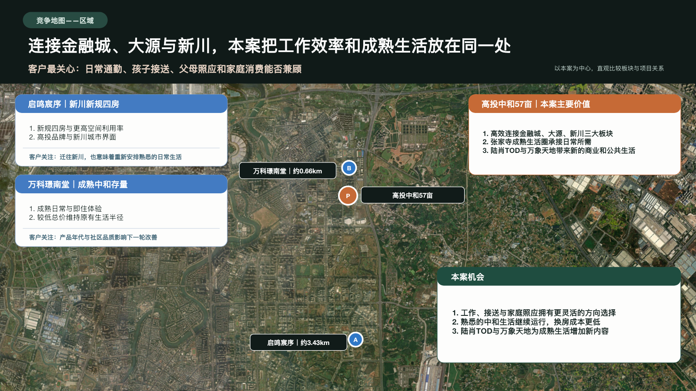 | 竞争地图 | `P3-COMPETITION-MAP` | 承认替代选择并重设比较标准 | 选择局面之后 |
| 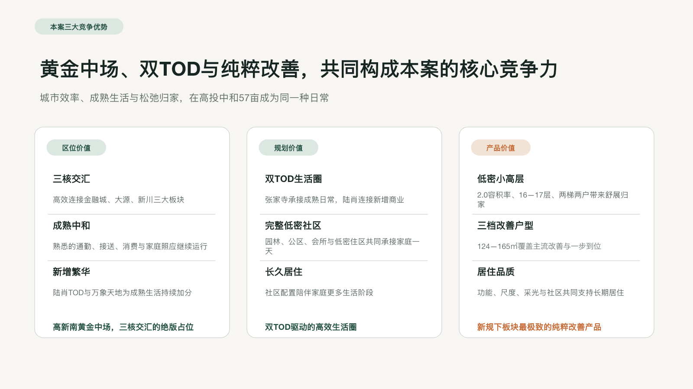 | 优势收敛 | `P3-ADVANTAGE-SYNTHESIS` | 把多张地图压缩成3—4条判断 | 地图之后 |
| 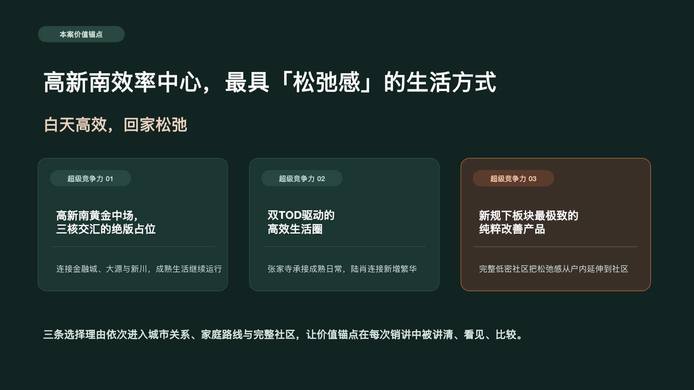 | 价值锚点 | `P3-VALUE-ANCHOR` | 给出全篇统一的购买价值 | 第二章结尾 |
| 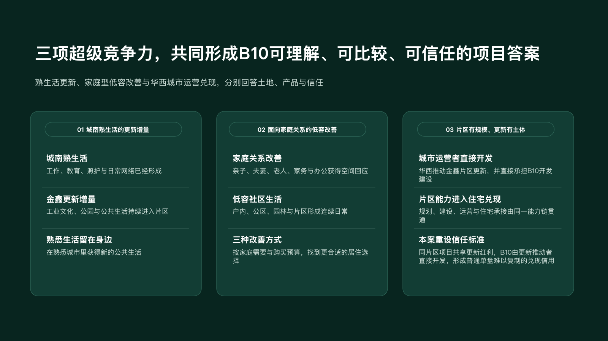 | 超级竞争力总览 | `P3-SC-OVERVIEW` | 展示3—4条竞争力如何共同作用 | 第二章末或第三章开头 |
| 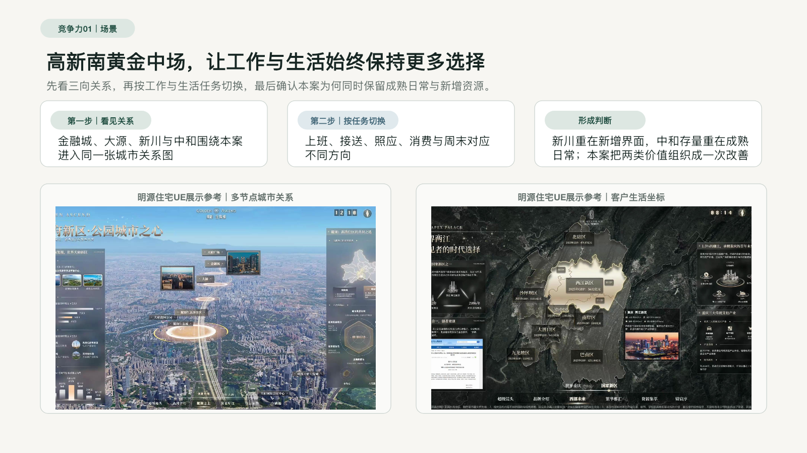 | 竞争力场景 | `P3-SC-SCENE` | 先讲客户获得与项目机制 | 每条竞争力起点 |
|  | 竞争力证明 | `P3-SC-PROOF` | 用图像、比较或系统界面证明上一页 | 场景页之后 |
| 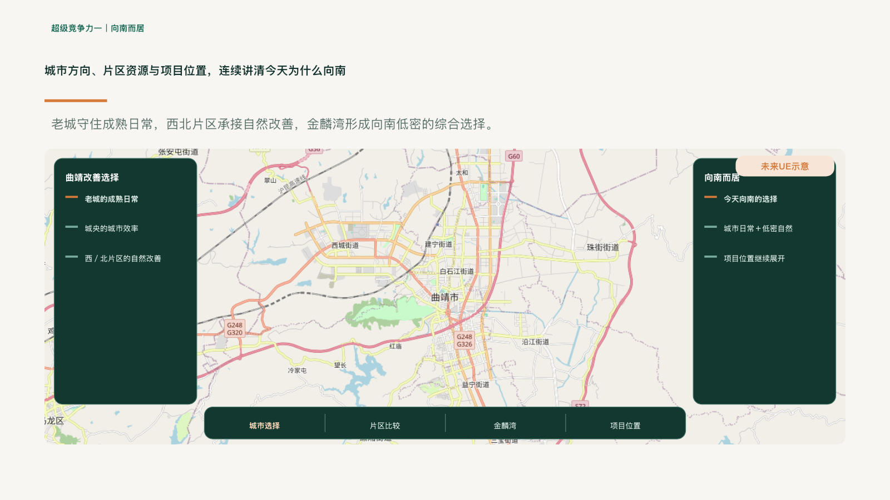 | 全屏UE展示 | `P3-UE-FULLSCREEN` | 让未来案场体验一眼可见 | 第三章主体，按需 |
|  | 家庭分类 | `P3-FAMILY-SEGMENT` | 说明不同家庭为什么需要不同路径 | 竞争力之后 |
|  | 家庭路径 | `P3-FAMILY-PATH` | 把处境、选择、产品与展示串起来 | 每类家庭一页或合并 |
| 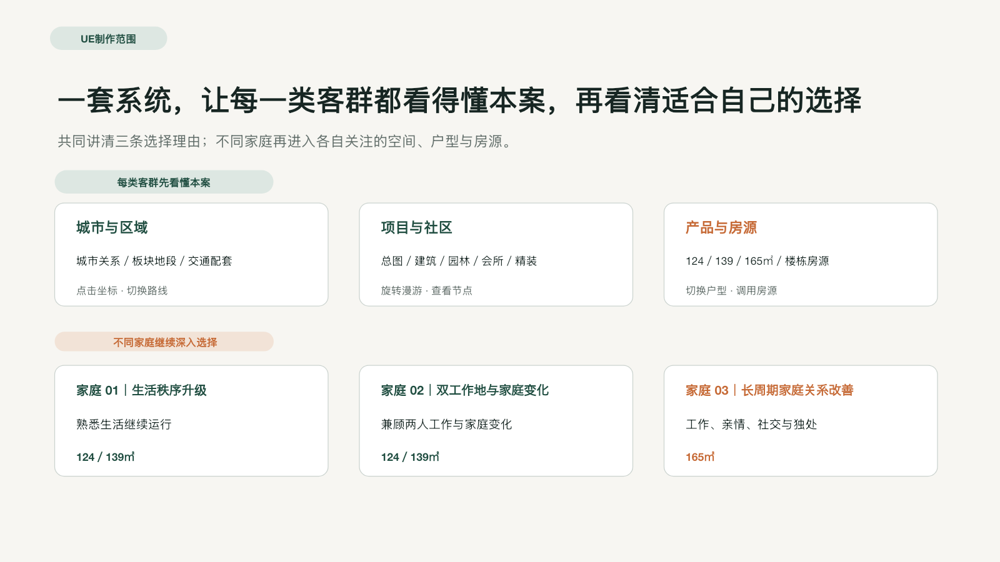 | UE制作蓝图 | `P3-UE-BLUEPRINT` | 把已成立语义投影为制作范围 | 第三章后段 |
| 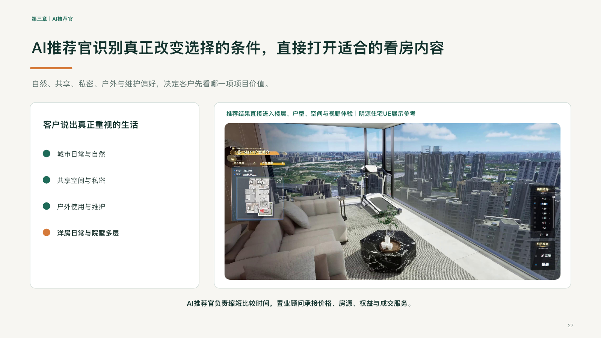 | AI推荐官 | `P3-AI-RECOMMENDER` | 说明推荐分流如何打开适合内容 | 蓝图附近，按需 |
|  | 最终收口 | `P3-CLOSING-OUTCOME` | 把方案压缩成甲方能记住的结果 | 结尾 |

## 页面语义卡

### 1. 封面主张｜`P3-COVER-CLAIM`

- 真人审阅句：这份方案要让哪个项目价值被讲清、看见并进入选择。
- 适用：统一业务语义核已经形成价值锚点。
- 不适用：仍在罗列区位、产品与资源，尚未收敛购买问题。
- 必装内容：项目名、一句价值主张、一句使用场景或方案定位。
- 视觉结构：深色整页、一个视觉重心、少量文字。
- 演讲动作：定题 → 说明解决对象 → 进入项目理解。
- 证据责任：不在封面展开证据；主张必须能被后文完整承接。
- 转场：进入研究底盘或客户选择局面。

### 2. 章节切换｜`P3-SECTION-PROMISE`

- 真人审阅句：下一章要回答一个清楚的问题，而不是只报章节名。
- 适用：第二章、第三章或标准章节之间。
- 必装内容：章节号、章节承诺、读者获得。
- 视觉结构：深色整页、超大标题、单一强调线。
- 演讲动作：回收上一章 → 提出下一问 → 说明回答路径。
- 证据责任：无独立证据，承诺必须与后续页面数量和职责一致。
- 转场：下一页立即开始回答，禁止再放一页重复目录。

### 3. 检索能力与研究底盘｜`P3-RESEARCH-CREDIBILITY`

- 真人审阅句：工程能否说明检索覆盖了什么、怎样筛选，并最终形成哪些可用于项目判断的市场底盘。
- 适用：需要前台说明公开渠道、定向咨询或其他已授权检索能力，且证据边界允许呈现。
- 不适用：只有运行日志、内部治理状态或未经裁定的候选数据。
- 必装内容：渠道／信息覆盖、有效查询或选择事件、筛选与交叉过程、形成的可用判断；数字必须采用当前项目真实口径。
- 视觉结构：数据仪表盘、过程关系图、少量底部结论。
- 演讲动作：说明观察范围 → 说明如何筛选 → 说明结论能支持什么。
- 证据责任：来源等级、样本口径和边界必须真实；治理细节留后台。
- 转场：进入公开客户声音或客户选择局面。
- 使用边界：这是可选能力页，不代表当前版本要生产完整第一章；曲靖`QJ-03`是首个成熟参考页。

### 4. 公开客户声音｜`P3-BUYER-VOICE`

- 真人审阅句：市场中的选择者正在用什么语言描述改善、替代与犹豫。
- 适用：存在合规、可追溯且允许前台使用的公开客户声音。
- 不适用：把个别表达写成普遍比例或成交归因。
- 必装内容：默认呈现8—10条公开声音；每条保留必要语境、选择条件和来源邻接信息，并在底部形成不超过一条的收敛结论。若真实合格样本不足8条，必须减量并明示当前样本，不得补造。
- 视觉结构：多卡片、颜色区分答案类别、底部一句判断。
- 演讲动作：让客户开口 → 分类选择条件 → 提出项目要回答的问题。
- 证据责任：原声可追溯，结论等级与样本强度一致。
- 转场：进入客户选择局面。
- 使用边界：这是可选市场声音页，不代表当前版本要生产完整第一章；曲靖`QJ-04`是8条公开声音的成熟参考页。

### 5. 客户选择局面｜`P3-CHOICE-SITUATION`

- 真人审阅句：项目面对的不是抽象客群，而是几种现实条件下的替代选择。
- 适用：竞品角色、购买任务与项目承接已经闭合。
- 必装内容：中央项目、3—5个现实条件或替代答案、共同选择问题。
- 视觉结构：中心卡＋四周条件卡，或连续三步选择卡。
- 演讲动作：摆出现实处境 → 承认替代选择 → 定义同一场比较。
- 证据责任：不把家庭猜测冒充事实；条件来自项目研究或明确假设。
- 转场：进入竞争地图。

### 6. 竞争地图｜`P3-COMPETITION-MAP`

- 真人审阅句：在一个明确比较维度上，本案与真实替代选择各自为何会被选择。
- 适用：区域、规划、产品、生活任务等有可比关系的维度。
- 不适用：只画距离，没有购买任务和比较结论。
- 必装内容：本案、真实替代、客户最关心、相对关系、本案机会。
- 视觉结构：地图或关系底图＋对比卡＋机会结论。
- 演讲动作：承认对手 → 统一口径比较 → 重设标准。
- 证据责任：项目位置、竞品角色、距离与事实口径可追溯。
- 转场：下一张竞争地图，或进入优势收敛。

### 7. 优势收敛｜`P3-ADVANTAGE-SYNTHESIS`

- 真人审阅句：前面多张比较最终只留下3—4条机制不同的核心判断。
- 适用：竞争地图已充分，准备进入价值锚点。
- 必装内容：判断名称、项目承接、客户获得、相对竞争关系。
- 视觉结构：三至四张纵向卡，信息层级一致。
- 演讲动作：回收比较 → 命名优势 → 解释共同覆盖什么。
- 证据责任：每条都能追溯到事实、竞品和客户选择关系。
- 转场：进入价值锚点。

### 8. 价值锚点｜`P3-VALUE-ANCHOR`

- 真人审阅句：全篇只有一个最值得记住的价值锚点，3—4条竞争力共同支撑它。
- 适用：超级竞争力已通过业务裁定。
- 必装内容：价值锚点、3—4条竞争力、共同作用。
- 视觉结构：深色整页＋三至四张卡。
- 演讲动作：一句命名 → 三项支撑 → 说明为何形成购买理由。
- 证据责任：不得用生活方式文案补事实或比较断层。
- 转场：进入第三章或超级竞争力总览。

### 9. 超级竞争力总览｜`P3-SC-OVERVIEW`

- 真人审阅句：3—4条竞争力分别解决进入候选、赢得比较和促进行动中的什么问题。
- 适用：需要在展开前给出导航，或在展开后进行收束。
- 必装内容：竞争力编号、名称、客户获得、项目机制。
- 视觉结构：三至四张同构卡，深色或浅色均可。
- 演讲动作：总览 → 交代分工 → 指向逐条证明。
- 证据责任：数量遵循当前项目业务核，不机械固定为三条。
- 转场：进入第一条竞争力场景。

### 10. 竞争力场景｜`P3-SC-SCENE`

- 真人审阅句：先让人理解客户获得和项目机制，再进入图像或系统证明。
- 适用：每条超级竞争力的开场。
- 必装内容：场景主张、2—4个推理动作、项目承接。
- 视觉结构：三卡、四卡或大数字＋解释卡。
- 演讲动作：说客户处境 → 说项目如何承接 → 说形成什么判断。
- 证据责任：主张必须能被下一页或本页下半部证明。
- 转场：进入竞争力证明或全屏UE展示。

### 11. 竞争力证明｜`P3-SC-PROOF`

- 真人审阅句：上一页的主张，在什么图像、事实、比较或界面中看得见。
- 适用：存在合规白名单图片、系统制作图或可前台呈现的比较。
- 必装内容：证明对象、相对前页新增的图像／数据／项目关系、解释短句、结论。
- 视觉结构：双图、单幅横图、上卡下图或图表。
- 演讲动作：指出证据 → 解释关系 → 回扣竞争力。
- 证据责任：图片来源和业务语义合规，不把示意当实景；相邻证明页必须提供新的客户判断、项目关系或独立图证。
- 转场：下一条竞争力或回到总览。

### 12. 全屏UE展示｜`P3-UE-FULLSCREEN`

- 真人审阅句：未来电子沙盘如何让某个购买价值在案场直接被看见和操作。
- 适用：已经有系统界面、可信线稿或业务语义复核后的效果图。
- 不适用：只有甲方原始截图，或画面与本案事实不一致。
- 必装内容：主画面、一级菜单、二级内容、当前销售动作。
- 视觉结构：全屏底图＋双侧面板＋底部菜单。
- 演讲动作：定位视角 → 演示操作 → 说明客户判断如何变化。
- 证据责任：明确未来示意、案例参考或本案设计状态。
- 转场：进入同一竞争力的下一证明，或回到家庭路径。

### 13. 家庭分类｜`P3-FAMILY-SEGMENT`

- 真人审阅句：不同家庭因处境、关系、改善目的和承担代价不同，需要不同讲解路径。
- 适用：家庭判断已达到比较解释或项目匹配的可用强度。
- 必装内容：家庭处境、改善目的、产品区间、核心取舍，以及与家庭角色和任务相符的人物肖像；三类家庭对应三张图。
- 视觉结构：三至四张人物／任务竖卡。
- 演讲动作：区分家庭 → 说明选择任务 → 指向分路径讲解。
- 证据责任：不以面积直接推导家庭阶段；先按业务语义检索共享案例图，无命中时新生产、复核并登记素材编号，空人物位不得进入正式PPT。
- 转场：进入第一类家庭路径。

### 14. 家庭路径｜`P3-FAMILY-PATH`

- 真人审阅句：这一类家庭从现实处境出发，经过哪些比较，最终看见哪种产品和生活改善。
- 适用：家庭任务、抗性、产品匹配与展示内容已经连通。
- 必装内容：现状、促成／阻断、替代、项目获得、展示证明。
- 视觉结构：上方四卡＋下方一至两幅场景图。
- 演讲动作：说处境 → 说选择门槛 → 说本案如何证明。
- 证据责任：家庭路径是销售解释，不伪装成真实客户旅程。
- 转场：下一类家庭，或进入UE制作蓝图。

### 15. UE制作蓝图｜`P3-UE-BLUEPRINT`

- 真人审阅句：前面成立的价值、家庭路径与销讲任务，具体投影成哪些可制作内容。
- 适用：第二章业务语义已冻结，第三章范围可被采购或生产岗位理解。
- 必装内容：通用接待、分支内容、交互动作、推荐分流、素材边界。
- 视觉结构：上下两层六卡或同等清晰的范围矩阵。
- 演讲动作：回收业务目标 → 展开制作模块 → 说明共用与分支。
- 证据责任：区分已具备、拟制作、待素材；不把蓝图写成已开发系统。
- 转场：进入AI推荐官或最终收口。

### 16. AI推荐官｜`P3-AI-RECOMMENDER`

- 真人审阅句：AI如何识别真正改变选择的条件，并直接打开适合的看房内容。
- 适用：当前任务明确启用推荐官，且选择条件与内容分流已闭合。
- 必装内容：输入条件、判断逻辑、打开内容、人工接待衔接。
- 视觉结构：左侧条件／逻辑＋右侧界面／结果。
- 演讲动作：提出条件 → 演示分流 → 说明顾问如何继续。
- 证据责任：不夸大模型能力，不把概念演示写成已上线效果。
- 转场：进入制作范围或最终收口。

### 17. 最终收口｜`P3-CLOSING-OUTCOME`

- 真人审阅句：甲方离场时应记住方案给销售带来的三个结果。
- 适用：全篇逻辑和制作范围已经闭合。
- 必装内容：一句最终主张、2—4个结果、与价值锚点的回扣。
- 视觉结构：深色整页＋少量结果卡。
- 演讲动作：回收购买问题 → 回收展示方法 → 给出最终结果。
- 证据责任：结果用“让什么更清楚、更可见、更可比较”等可兑现表达，不虚构客户采纳或业务成效。
- 转场：结束或进入标准交付履约章节。

## 装配规则

1. 每页只能有一个主语义；辅助功能写进 `secondary_role`，不能把两页硬塞成一页。
2. `客户选择局面—竞争地图—优势收敛—价值锚点`是第二章主链；删页时必须说明哪一段逻辑由相邻页接管。
3. `竞争力场景—竞争力证明`默认成对；素材不足时可合并，但要保留“主张→证明”的关系。
4. `家庭分类—家庭路径—UE制作蓝图`把客户选择转成销讲与制作，不得提前替代第二章竞争推导。
5. 真人可用页码和中文名称修改；系统在每次重建后自动刷新页码，稳定 ID 不随调序变化。
6. 历史来源页只决定结构候选，不决定当前项目文案、事实和图片。
7. 正式项目复用历史来源页时，必须清除来源项目文字并装载当前项目标题、卡片和正文；整页原文复用只允许技术夹具。
8. 客户正文不显示“价值账、家庭优先级重算、四个WHY门禁”等内部推导；相邻页没有新判断、新关系或新图证时合并或退回重组。
